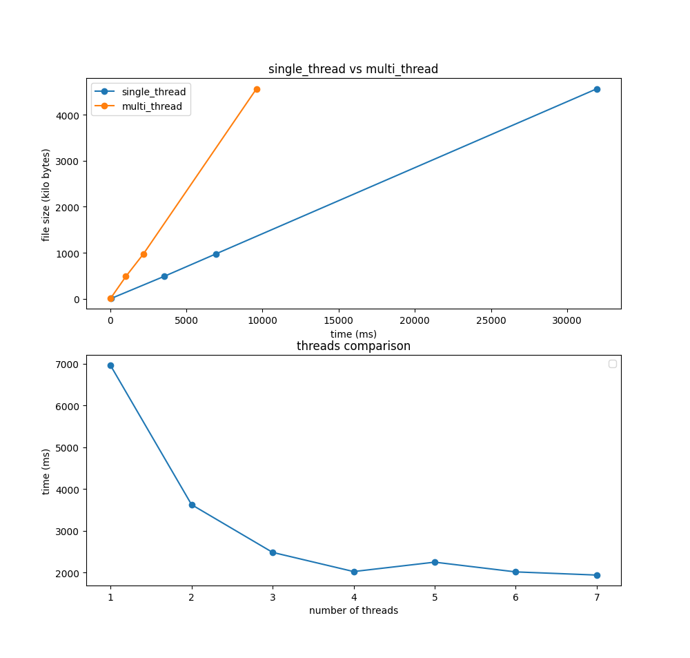

# Real-time & Embedded Systems project
## Scope
The project consists in the implementation of a multi-thread library for the AES encryption scheme in CTR mode.
This has been done using the thread directive of the C++ language which are implemented using the pthread library.
The aim of this project was to become familiar with C++, concurrent programming and encryption schemes.

## Structure
The project is structured in the following way:
- `src` contains the source code of the library
- `inc` contains the header files of the library and utility files
- `test` contains the source code of the test program and a python script to plot the results
- `bin` contains the executable of the test program

## How to compile
This project uses the CMake build system. To compile the library and the test program, run `cmake` in the root dir.
The test executable will be placed in the `bin` directory with the appropriate linking to the libraries.

Inside the folder project, run:
```
cmake --build aes-ctr/cmake-build --target test -j 6
```
This will create a project binary tree inside cmake-build and copy the executable inside the `bin` folder

## Library usage
The API of the library is defined in the `inc/aes.h` header file. The library is composed of the following functions:
- `AES(num_threads)`: initializes the library with the given number of threads
- `int encrypt(std::string &plaintext, k &key, std::string &ciphertext)` : single-thread encryption
- `int decrypt(std::string &ciphertext, k &key, std::string &plaintext)` : single-thread decryption
- `int encrypt_multi_thread(std::string &plaintext, k &key, std::string &ciphertext)` : multi-thread encryption
- `int decrypt_multi_thread(std::string &ciphertext, k &key, std::string &plaintext)` : multi-thread decryption

## Algorithm
The algorithm used for the encryption and decryption is the one described in the 
[NIST FIPS 197](https://nvlpubs.nist.gov/nistpubs/FIPS/NIST.FIPS.197.pdf) document.
The mode used is the CTR mode, which is described in the 
[NIST SP 800-38A](https://nvlpubs.nist.gov/nistpubs/Legacy/SP/nistspecialpublication800-38a.pdf) document.
This mode is a stream cipher mode, which means that the plaintext is encrypted one block at a time, which is optimal 
for parallelization.


The block is XORed with a counter composed as the following:
- 64 bits of `nonce`
- 64 bits of `counter`

The `nonce` is a random number that is used to avoid the repetition of the encryption output when the same plaintext is
encrypted with the same key. The `nonce` is generated using C++ `std::random` functions.

The `counter` is a number that is incremented at each block encryption. This means that every thread which knows in 
advance the number of blocks it has to encrypt can compute the counter of the first block and then increment it at each
block encryption.

The encryption and decryption functions are the same, because the CTR mode is a stream cipher mode.

## Results
The results of the tests are in the `test` directory. The tests have been run on a machine with the following specs:
- CPU: Intel Core i5-8250U
- RAM: 16GB DDR4
- OS: Fedora 38

Two types of tests have been run:
- Single-thread encryption vs multi-thread encryption
- Number of threads encryption time comparison

In the former a number of tests have been run using file of increasing size, ranging from 1 MB to 50 MB. 
In the latter the tests have been run, on the 10 MB file, by increasing the number of threads until hardware limit.
The results are plotted in the following image.



As the image shows, the advantages of the multi thread encryption only outweigh the disadvantages of the thread-spawning-overhead as the file increases, but they do it so rather quickly.

From the second image instead, we can infer that the speed-up given by the number of threads has a threshold after which
no gain is made.

## Limits and possible improvements
Currently, the deciphered text is stored on RAM, which means that the library is not suitable for large files.
A possible improvement could be to store the deciphered text on disk, but this would require a different approach to the
multi-threading, because the threads would have to write to the same file in a coordinated way. Another approach could
be to use a helper thread that writes to the file when the buffer is nearly full.
